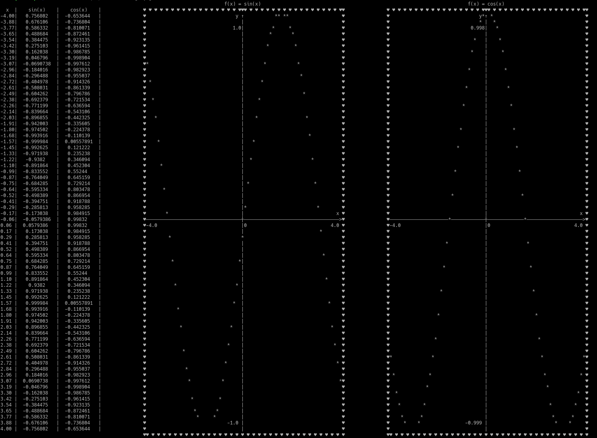

# functions-drawer
Script for linux systems, that draw function graphs and values table.
Functions must be one dimntional, and explicitly specified. Script handels depenedency install through pip.

You can specify function numbers, frame, define x value range, add/remove values table, and many more.
